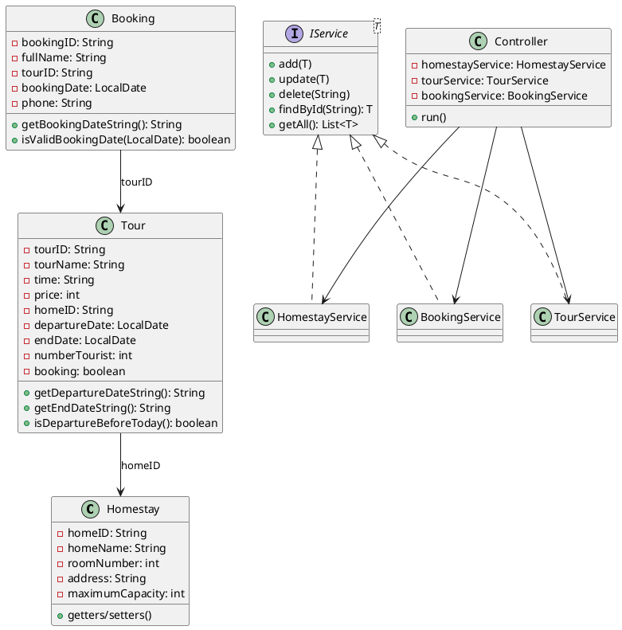

# Class Diagram - Hướng Dẫn

## Tổng Quan

Class Diagram mô tả cấu trúc các lớp trong hệ thống và mối quan hệ giữa chúng.

---

## Các Lớp Chính

### 1. Models Layer

```
┌──────────────────────────────┐
│         Homestay             │
├──────────────────────────────┤
│ - homeID: String             │
│ - homeName: String           │
│ - roomNumber: int            │
│ - address: String            │
│ - maximumCapacity: int       │
├──────────────────────────────┤
│ + getters/setters            │
│ + toString(): String         │
└──────────────────────────────┘

┌──────────────────────────────┐
│           Tour               │
├──────────────────────────────┤
│ - tourID: String             │
│ - tourName: String           │
│ - time: String               │
│ - price: int                 │
│ - homeID: String             │
│ - departureDate: LocalDate   │  ✅
│ - endDate: LocalDate         │  ✅
│ - numberTourist: int         │
│ - booking: boolean           │
├──────────────────────────────┤
│ + getters/setters            │
│ + getDepartureDateString()   │
│ + getEndDateString()         │
│ + isDepartureBeforeToday()   │
│ + toString(): String         │
└──────────────────────────────┘

┌──────────────────────────────┐
│         Booking              │
├──────────────────────────────┤
│ - bookingID: String          │
│ - fullName: String           │
│ - tourID: String             │
│ - bookingDate: LocalDate     │  ✅
│ - phone: String              │
├──────────────────────────────┤
│ + getters/setters            │
│ + getBookingDateString()     │
│ + isValidBookingDate()       │
│ + toString(): String         │
└──────────────────────────────┘
```

### 2. Service Layer

```
┌──────────────────────────────────────┐
│         <<interface>>                │
│           IService<T>                │
├──────────────────────────────────────┤
│ + add(item: T): void                 │
│ + update(item: T): void              │
│ + delete(id: String): void           │
│ + findById(id: String): T            │
│ + getAll(): List<T>                  │
└──────────────────────────────────────┘
           △
           │ implements
    ┌──────┼──────┐
    │      │      │
┌───┴───┐ ┌┴────┐ ┌┴──────┐
│Homestay│ │Tour │ │Booking│
│Service │ │Serv.│ │Serv.  │
└────────┘ └─────┘ └───────┘
```

### 3. Relationships

```
                    ┌────────────┐
                    │   Main     │
                    └─────┬──────┘
                          │ uses
                          ▼
                    ┌────────────┐
                    │ Controller │
                    └─────┬──────┘
           ┌──────────────┼──────────────┐
           │              │              │
           ▼              ▼              ▼
    ┌──────────┐   ┌──────────┐   ┌───────────┐
    │HomestayS.│   │ TourS.   │   │ BookingS. │
    └────┬─────┘   └────┬─────┘   └─────┬─────┘
         │              │               │
         ▼              ▼               ▼
    ┌──────────┐   ┌──────────┐   ┌───────────┐
    │ Homestay │   │   Tour   │   │  Booking  │
    └──────────┘   └──────────┘   └───────────┘
                          │
                          │ homeID
                          ▼
                    ┌──────────┐
                    │ Homestay │
                    └──────────┘
```

---

## Mối Quan Hệ

| Từ | Đến | Loại | Mô tả |
|----|-----|------|-------|
| Controller | HomestayService | Association | Controller sử dụng HomestayService |
| Controller | TourService | Association | Controller sử dụng TourService |
| Controller | BookingService | Association | Controller sử dụng BookingService |
| Controller | Menu | Association | Controller sử dụng Menu |
| Tour | Homestay | Association | Tour tham chiếu đến Homestay qua homeID |
| Booking | Tour | Association | Booking tham chiếu đến Tour qua tourID |
| *Service | IService | Implementation | Các Service implement IService |

---

## Công Cụ Vẽ Diagram Gợi Ý

1. **Draw.io** (diagrams.net) - Miễn phí, online
2. **PlantUML** - Text-based UML
3. **Lucidchart** - Professional tool
4. **StarUML** - Desktop application
5. **Visual Paradigm** - Full-featured

---

## PlantUML Code (Optional)


