<br>
---

<div align="center">

# **FPT UNIVERSITY**

#### **CAMPUS HO CHI MINH CITY**

---

### **LAB 2 PROJECT REPORT**

## **Homestay Booking Management Application**

**Course:** Lab 211

**Instructor:** Than Thi Ngoc Van

**Student Name:** Nguyen Van Gia Binh

**Date:** February 27, 2026

</div>

---

<div style="page-break-after: always;"></div>

# Table of Contents

1. [Introduction](#1-introduction)
   - 1.1 [Context](#11-context-bối-cảnh)
   - 1.2 [Purpose](#12-aim--scope-mục-tiêu--phạm-vi)
2. [System Overview &amp; Design](#2-system-overview--design)
   - 2.1 [System Architecture)](#21-system-architecture-kiến-trúc-hệ-thống)
   - 2.2 [Actors &amp; Use Cases (Các tác nhân và tính năng)](#22-actors--use-cases-các-tác-nhân-và-tính-năng)
   - 2.3 [Class Diagram &amp; Entity Analysis (Phân tích thực thể và biểu đồ lớp)](#23-class-diagram--entity-analysis-phân-tích-thực-thể-và-biểu-đồ-lớp)
   - 2.4 [Data Storage Structure (Cấu trúc file lưu trữ)](#24-data-storage-structure-cấu-trúc-file-lưu-trữ)
   - 2.5 [Validation &amp; Core Logic Rules (Các quy tắc ràng buộc quan trọng)](#25-validation--core-logic-rules-các-quy-tắc-ràng-buộc-quan-trọng)
3. [Implementation &amp; Function Flows](#3-implementation--function-flows)
   - 3.1 [Main Flow Process](#31-main-flow-process)
   - 3.2 [Detailed Flows for Key Functions](#32-detailed-flows-for-key-functions)
4. [Testing &amp; Evaluation](#4-testing--evaluation)
   - 4.1 [Test Cases for Core Validations](#41-test-cases-for-core-validations)
5. [Conclusion](#5-conclusion)
   - 5.1 [Summary](#51-summary)
   - 5.2 [Limitations](#52-limitations)
   - 5.3 [Future Work](#53-future-work)

---

<div style="page-break-after: always;"></div>

# 1. Introduction

## 1.1 Context

The Homestay Booking Management Application is a console-based Java application. The application addresses the need for a structured system to manage homestay accommodations, tour packages, and booking records.

In Vietnam's rapidly growing tourism market, homestay owners and travel operators need efficient tools to manage tour information, track bookings, and generate statistical reports. This application provides a simplified yet functional solution for managing these core operations through a text-based menu interface.

## 1.2 Purpose

### Purpose

The primary objective of this project is to build a fully functional **Homestay Booking Management System** that allows users to:

- **Manage Tours:** Add new tours, update tour information, and query tours based on date criteria.
- **Manage Bookings:** Create, update, remove, and search booking records.
- **Generate Reports:** view statistical summaries such as total booking amounts and tourist counts per homestay.
- **Persist Data:** Save and load all data from text files to ensure data persistence between sessions.

<div style="page-break-after: always;"></div>

# 2. System Overview & Design

## 2.1 System Architecture (Kiến trúc hệ thống)

The application follows a **layered MVC-like architecture** with clear separation of concerns across 6 packages:

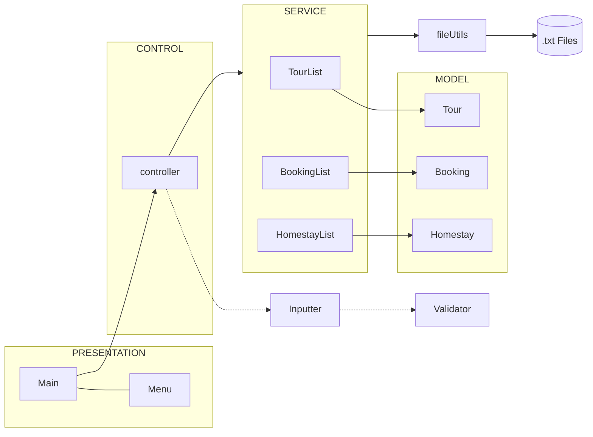

### Package Structure (Cấu trúc gói)

```
src/
├── Main.java                    # Entry point - Application launcher
├── SandBox.java                 # Testing/Sandbox file (development only)
├── models/                      # Data model classes (POJO)
│   ├── Homestay.java           #   Homestay entity
│   ├── Tour.java               #   Tour entity
│   └── Booking.java            #   Booking entity
├── service/                     # Business service layer
│   ├── IService.java           #   Generic service interface
│   ├── HomestayList.java       #   Homestay collection & operations
│   ├── TourList.java           #   Tour collection & CRUD operations
│   └── BookingList.java        #   Booking collection & CRUD operations
├── controller/                   # Controller layer
│   └── controller.java          #   Main business logic controller
├── view/                        # Presentation layer
│   └── Menu.java               #   Menu display & user choice
├── fileUtils/                   # File I/O utilities
│   └── fileUtils.java          #   Generic read/write operations
├── utilities/                   # Input & validation utilities
│   ├── Inputter.java           #   User input handling
│   └── Validator.java          #   Regex validation patterns
Data/
├── Homestays.txt               # Homestay data storage
├── Tours.txt                   # Tour data storage
└── Bookings.txt                # Booking data storage
```

### Architecture Diagram (Biểu đồ kiến trúc)

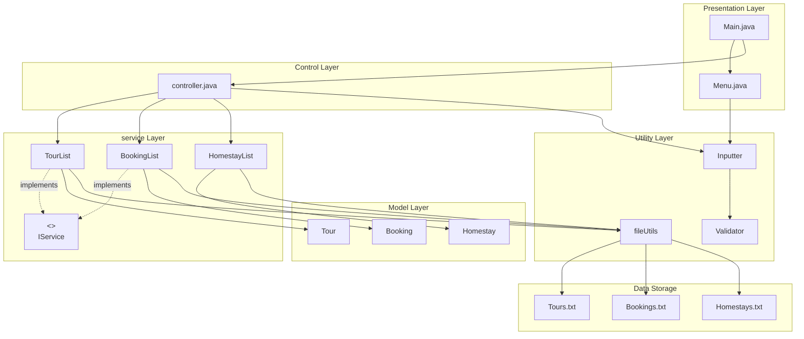

## 2.2 Actors & Use Cases (Các tác nhân và tính năng)

### Actor (Tác nhân)

There is **one primary actor** in this system:

| Actor                          | Description                                                                                                                                                  |
| ------------------------------ | ------------------------------------------------------------------------------------------------------------------------------------------------------------ |
| **User (Người dùng)** | The operator who interacts with the console menu to manage tours, bookings, and view statistics. This person is typically a homestay owner or tour operator. |

### Use Case Diagram (Biểu đồ Use Case)

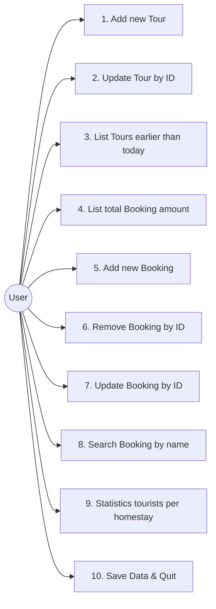

### Use Case Descriptions (Mô tả Use Case)

| #  | Use Case                                   | Description                                                                                                                              | Pre-condition            | Post-condition               |
| -- | ------------------------------------------ | ---------------------------------------------------------------------------------------------------------------------------------------- | ------------------------ | ---------------------------- |
| 1  | **Add new Tour**                     | User inputs tour details (ID, name, time, price, homestay ID, dates, tourists). System validates all inputs and checks for date overlap. | Homestay exists          | Tour added to list           |
| 2  | **Update Tour by ID**                | User searches for a tour by ID, then can update any field (skip with Enter)                                                              | Tour exists              | Tour info updated            |
| 3  | **List Tours earlier than today**    | Display all tours with departure date before today                                                                                       | Tour list loaded         | Tours displayed              |
| 4  | **List total Booking amount**        | Display booked tours with departure > today, sorted by total amount (price × tourists) descending                                       | Tours & bookings loaded  | Sorted list displayed        |
| 5  | **Add new Booking**                  | User creates a booking linked to an unbooked tour. System marks tour as booked.                                                          | Tour exists & not booked | Booking created, tour marked |
| 6  | **Remove Booking by ID**             | User removes an existing booking by its ID                                                                                               | Booking exists           | Booking removed from list    |
| 7  | **Update Booking by ID**             | User updates booking details (name, phone)                                                                                               | Booking exists           | Booking info updated         |
| 8  | **Search Booking by name**           | Search bookings by full name (case-insensitive, partial match)                                                                           | Bookings loaded          | Matching bookings displayed  |
| 9  | **Statistics tourists per homestay** | Aggregate and display total tourists per homestay based on booked tours                                                                  | All data loaded          | Statistics displayed         |
| 10 | **Save Data & Quit**                 | User is prompted to save data before exiting the application                                                                             | —                       | Data saved to files          |

## 2.3 Class Diagram & Entity Analysis 

### Class Diagram 

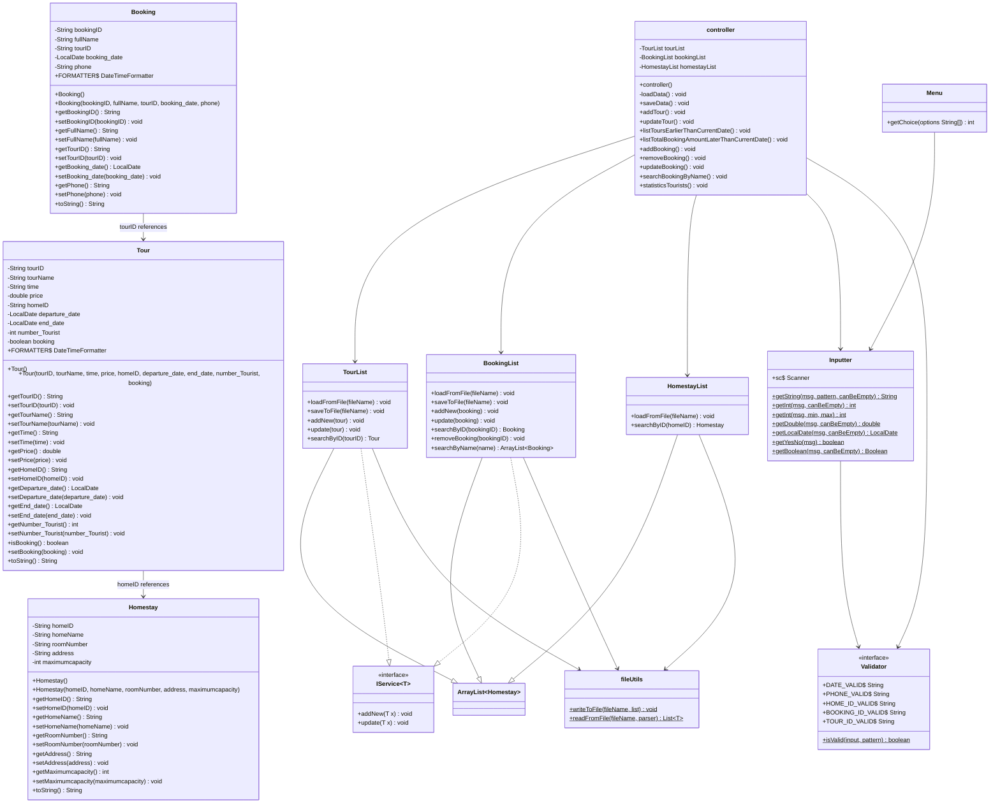

### Entity Analysis 

#### Entity: `Homestay`

| Attribute           | Type       | Description                    | Example                                          |
| ------------------- | ---------- | ------------------------------ | ------------------------------------------------ |
| `homeID`          | `String` | Unique ID, format:`HSXXXX`   | `HS0001`                                       |
| `homeName`        | `String` | Name of the homestay           | `Alee DaLat Homestay`                          |
| `roomNumber`      | `String` | Room identifier/number         | `3`                                            |
| `address`         | `String` | Full address                   | `12A/6 3rd February Street, Ward 1, Da Lat...` |
| `maximumcapacity` | `int`    | Max number of tourists allowed | `15`                                           |

#### Entity: `Tour`

| Attribute          | Type          | Description                  | Example             |
| ------------------ | ------------- | ---------------------------- | ------------------- |
| `tourID`         | `String`    | Unique ID, format:`TXXXXX` | `T00001`          |
| `tourName`       | `String`    | Route/name of the tour       | `TPHCM-Da Lat`    |
| `time`           | `String`    | Duration description         | `3 days 2 nights` |
| `price`          | `double`    | Price per tourist            | `400.0`           |
| `homeID`         | `String`    | Foreign key → Homestay      | `HS0001`          |
| `departure_date` | `LocalDate` | Tour start date              | `10/01/2026`      |
| `end_date`       | `LocalDate` | Tour end date                | `14/01/2026`      |
| `number_Tourist` | `int`       | Number of tourists           | `7`               |
| `booking`        | `boolean`   | Whether tour is booked       | `false`           |

#### Entity: `Booking`

| Attribute        | Type          | Description                  | Example          |
| ---------------- | ------------- | ---------------------------- | ---------------- |
| `bookingID`    | `String`    | Unique ID, format:`BXXXXX` | `B00001`       |
| `fullName`     | `String`    | Customer full name           | `Nguyen Van A` |
| `tourID`       | `String`    | Foreign key → Tour          | `T00001`       |
| `booking_date` | `LocalDate` | Date of booking              | `12/12/2023`   |
| `phone`        | `String`    | Customer phone (10 digits)   | `0869089715`   |

### Entity Relationships (Quan hệ giữa các thực thể)

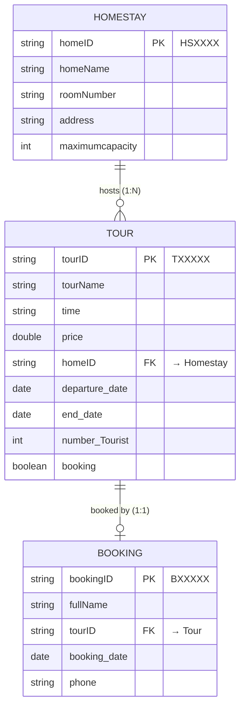

**Relationship Summary:**

- **Homestay ↔ Tour:** One-to-Many (1:N). One homestay can host multiple tours, but each tour belongs to exactly one homestay.
- **Tour ↔ Booking:** One-to-One (1:1). Each tour can have at most one booking. When a booking is created, the tour's `booking` flag is set to `true`.

## 2.4 Data Storage Structure

The application uses **plain text files** (`.txt`) for data persistence, located in the `Data/` directory.

### File: `Homestays.txt`

**Delimiter:** Hyphen (`-`)

**Format:** `homeID-homeName-roomNumber-address-maximumcapacity`

```
HS0001-Alee DaLat Homestay-3-12A/6 3rd February Street, Ward 1, Da Lat City, Lam Dong Province-15
HS0002-Tournesol Villa Homestay-4-12 Van Kiet Street, Ward 3, Da Lat City, Lam Dong Province-18
HS0003-HomeStay Butter House-2-Agency Sub-district, Farm Town, Moc Chau, Son LaProvince-10
HS0004-Moc Chau Hill House-3-Tay Tien Hill, Sub-district 12, Moc Chau, Son La Province-12
HS0005-Papa's Garden Homestay-3-1 Phuong Thanh Street, Me Thuong Village, Ha Giang 1 Ward, Tuyen Quang Province-10
HS0006-Dong Van CliffSide House	4-10 Don Cao, Dong Van Town, Ha Giang Ward, Tuyen Quang Province-14
```

> **Note:** Homestay data is **read-only** — the system does not modify this file.

### File: `Tours.txt`

**Delimiter:** Comma (`,`)

**Format:** `tourID,tourName,time,price,homeID,departure_date,end_date,number_Tourist,booking`

```
T00001,TPHCM-Da Lat,3 days 2 nights,400.000000,HS0001,10/01/2026,14/01/2026,7,false
T00002,TPHCM-Da Lat,3 days 2 nights,280.000000,HS0002,10/01/2026,12/01/2026,6,false
T00008,TPHCM-Nha Trang,6 days 5 nights,600.000000,HS0003,10/03/2026,16/03/2026,10,true
```

### File: `Bookings.txt`

**Delimiter:** Comma (`,`)

**Format:** `bookingID,fullName,tourID,booking_date,phone`

```
B00001,Nguyen Van A,T00001,12/12/2023,0869089715
```

## 2.5 Validation & Core Logic Rules (Các quy tắc ràng buộc quan trọng)

### Regex Validation Patterns

| Rule                   | Regex Pattern           | Description                                      | Example Valid  | Example Invalid                |
| ---------------------- | ----------------------- | ------------------------------------------------ | -------------- | ------------------------------ |
| **Tour ID**      | `^T\d{5}$`            | Starts with `T`, followed by exactly 5 digits  | `T00001`     | `T001`, `t00001`           |
| **Homestay ID**  | `^HS\d{4}$`           | Starts with `HS`, followed by exactly 4 digits | `HS0001`     | `HS01`, `hs0001`           |
| **Booking ID**   | `^B\d{5}$`            | Starts with `B`, followed by exactly 5 digits  | `B00001`     | `B001`, `b00001`           |
| **Phone Number** | `^\d{10}$`            | Exactly 10 digits                                | `0869089715` | `086908971`, `08690897155` |
| **Date Format**  | `^\d{2}/\d{2}/\d{4}$` | Format:`dd/MM/yyyy`                            | `10/01/2026` | `1/1/2026`, `2026-01-10`   |

### Business Logic Rules (Quy tắc nghiệp vụ)

#### Rule 1: Unique ID Constraint

- **Tour ID**, **Booking ID** must be unique across the system.
- Before adding, the system searches existing records to ensure no duplicates.

#### Rule 2: Homestay Existence Check

- When adding a tour, the `homeID` must reference an existing homestay in `HomestayList`.
- If the homestay is not found, the user must re-enter.

#### Rule 3: Date Logic — End Date ≥ Departure Date

- `end_date` must be on or after `departure_date`.
- Enforced during both tour **Add** and **Update** operations.

#### Rule 4: Tour Date Non-Overlap per Homestay

- Two tours assigned to the **same homestay** cannot have overlapping date ranges.
- Overlap check: `!(endDate.isBefore(existingTour.departure) || departureDate.isAfter(existingTour.end))`
- If overlap detected → user must re-enter dates.

#### Rule 5: Tourist Capacity Constraint

- `number_Tourist` must be **strictly less than** the homestay's `maximumcapacity`.
- Enforced during both tour **Add** and **Update**.

#### Rule 6: Tour Booking Status

- A tour can only be booked if `booking == false`.
- When a booking is created, the tour's `booking` flag is automatically set to `true`.

#### Rule 7: Booking Date Before Departure

- `booking_date` must be **before** the tour's `departure_date`.
- Ensures bookings are made in advance, not after the tour has started.

#### Rule 8: Input Can Be Empty (Update Operations)

- During update operations, pressing Enter (empty input) skips the field, keeping the original value.
- This applies to: Tour name, time, price, dates, number of tourists, booking status, and Booking name/phone.

#### Rule 9: Positive Number Constraint

- All numeric inputs (price, number of tourists, menu choices) must be **positive** (> 0).

---

<div style="page-break-after: always;"></div>

# 3. Implementation & Function Flows

## 3.1 Main Flow Process

The application follows a **menu-driven loop** pattern:

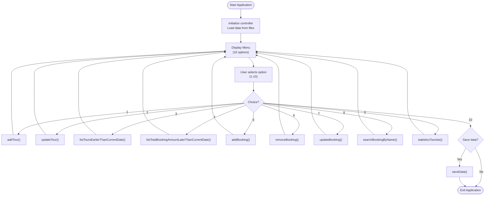

### Menu Options

```
-----------------------------------
1. Add new Tour
2. Update Tour by ID
3. List Tours with departure dates earlier than the current date
4. List total Booking amount for tours with departure > today
5. Add new Booking
6. Remove Booking by ID
7. Update Booking by ID
8. Search Booking by name
9. Statistics on tourists per homestay
10. Quit
Choose an option:
```

## 3.2 Detailed Flows for Key Functions

### 3.2.1 Function: `addTour()` — Add New Tour

#### Step-by-step Flow

| Step | Action                   | Validation                                                        |
| ---- | ------------------------ | ----------------------------------------------------------------- |
| 1    | Input Tour ID            | Regex `^T\d{5}$` + check uniqueness                             |
| 2    | Input Tour Name          | Non-empty string                                                  |
| 3    | Input Time               | Non-empty string                                                  |
| 4    | Input Price              | Positive double (> 0)                                             |
| 5    | Input Home ID            | Regex `^HS\d{4}$` + check existence in HomestayList             |
| 6    | Input Departure Date     | Format `dd/MM/yyyy`                                             |
| 7    | Input End Date           | Format `dd/MM/yyyy` + `endDate >= departureDate` + no overlap |
| 8    | Input Number of Tourists | Positive int +`< homestay.maximumcapacity`                      |
| 9    | Create Tour object       | `booking = false` by default                                    |
| 10   | Add to TourList          | Success message displayed                                         |
| 11   | Ask "Add another?"       | Y → repeat; N → return                                          |

#### Activity Diagram

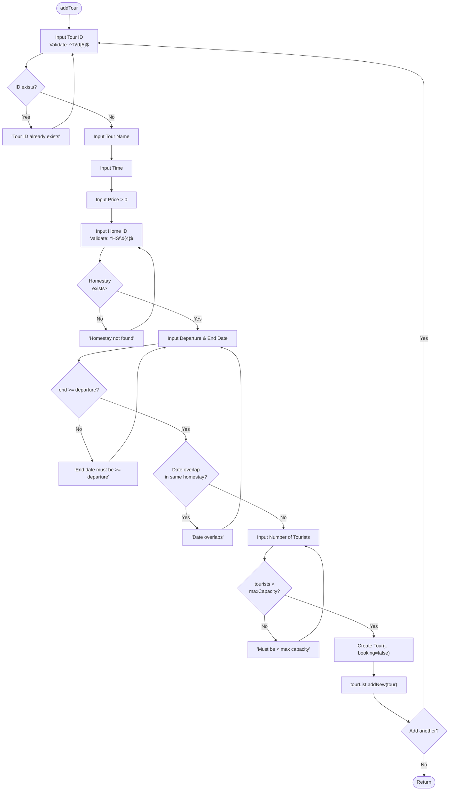

---

### 3.2.2 Function: `updateTour()` — Update Tour by ID

#### Step-by-step Flow

| Step | Action                         | Validation                                                        |
| ---- | ------------------------------ | ----------------------------------------------------------------- |
| 1    | Input Tour ID to update        | Regex + check existence                                           |
| 2    | Input new Tour Name            | Press Enter to skip                                               |
| 3    | Input new Time                 | Press Enter to skip                                               |
| 4    | Input new Price                | Press Enter to skip; must be > 0                                  |
| 5    | Input new Departure & End Date | Press Enter to skip; if both provided:`end >= dep` + no overlap |
| 6    | Input new Number of Tourists   | Press Enter to skip; must be < maxCapacity                        |
| 7    | Input new Booking status       | Press Enter to skip; Y/N                                          |
| 8    | Call `tourList.update(tour)` | Success message                                                   |

#### Sequence Diagram

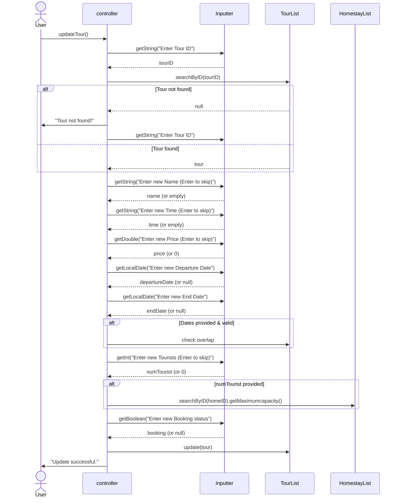

---

### 3.2.3 Function: `addBooking()` — Add New Booking

#### Step-by-step Flow

| Step | Action                  | Validation                                                  |
| ---- | ----------------------- | ----------------------------------------------------------- |
| 1    | Input Booking ID        | Regex `^B\d{5}$` + check uniqueness                       |
| 2    | Input Full Name         | Non-empty string                                            |
| 3    | Input Tour ID           | Regex `^T\d{5}$` + tour must exist + `booking == false` |
| 4    | Input Booking Date      | Format `dd/MM/yyyy` + must be before tour departure       |
| 5    | Input Phone             | Regex `^\d{10}$`                                          |
| 6    | Create Booking object   | —                                                          |
| 7    | Add to BookingList      | —                                                          |
| 8    | Set tour.booking = true | Auto-update tour status                                     |
| 9    | Update tour in TourList | Success message                                             |

#### Activity Diagram

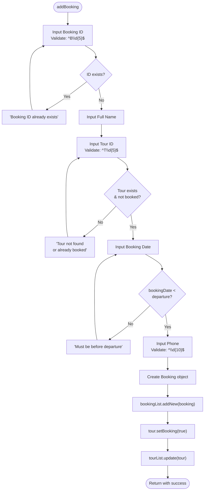

---

### 3.2.4 Function: `removeBooking()` — Remove Booking by ID

#### Step-by-step Flow

| Step | Action                  | Validation                           |
| ---- | ----------------------- | ------------------------------------ |
| 1    | Input Booking ID        | Regex `^B\d{5}$` + check existence |
| 2    | Remove from BookingList | `bookingList.removeBooking(id)`    |
| 3    | Display success message | —                                   |

---

### 3.2.5 Function: `updateBooking()` — Update Booking by ID

#### Step-by-step Flow

| Step | Action                         | Validation                              |
| ---- | ------------------------------ | --------------------------------------- |
| 1    | Input Booking ID to update     | Regex + check existence                 |
| 2    | Input new Full Name            | Press Enter to skip                     |
| 3    | Input new Phone                | Regex `^\d{10}$`; press Enter to skip |
| 4    | Call `bookingList.update(b)` | Success message                         |

---

### 3.2.6 Function: `searchBookingByName()` — Search Booking by Name

#### Step-by-step Flow

| Step | Action                                  | Description                                         |
| ---- | --------------------------------------- | --------------------------------------------------- |
| 1    | Input search name                       | Any non-empty string                                |
| 2    | Call `bookingList.searchByName(name)` | Case-insensitive partial match using `contains()` |
| 3    | Display results                         | If empty → "No booking found"                      |

---

### 3.2.7 Function: `listToursEarlierThanCurrentDate()` — List Past Tours

#### Logic

```java
for (Tour t : tourList) {
    if (t.getDeparture_date().isBefore(LocalDate.now())) {
        System.out.println(t);
    }
}
```

Filters and displays all tours whose `departure_date` is **before** today.

---

### 3.2.8 Function: `listTotalBookingAmountLaterThanCurrentDate()` — List Future Booked Tours

#### Step-by-step Flow

| Step | Action                                                           |
| ---- | ---------------------------------------------------------------- |
| 1    | Filter tours where `departure > today` AND `booking == true` |
| 2    | Sort by `Total Amount = price × number_Tourist` (descending)  |
| 3    | Display: Tour ID, Departure, Price, Tourists, Total Amount       |

#### Activity Diagram

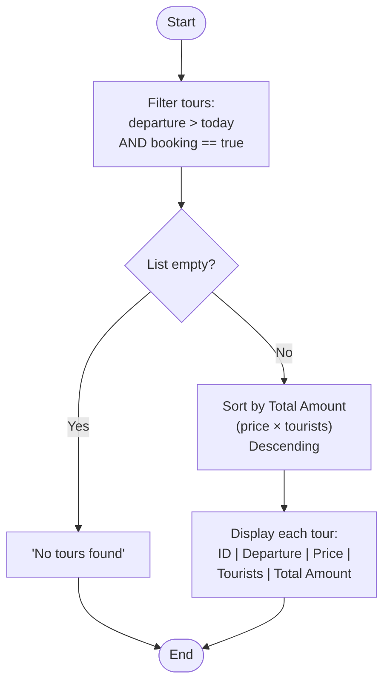

---

### 3.2.9 Function: `statisticsTourists()` — Tourists per Homestay

#### Step-by-step Flow

| Step | Action                                                                           |
| ---- | -------------------------------------------------------------------------------- |
| 1    | Initialize `HashMap<String, Integer>` with all homestay IDs → 0               |
| 2    | For each booking, find its tour; add tour's `number_Tourist` to homestay count |
| 3    | Display: Homestay Name + Tourist count                                           |

#### Activity Diagram

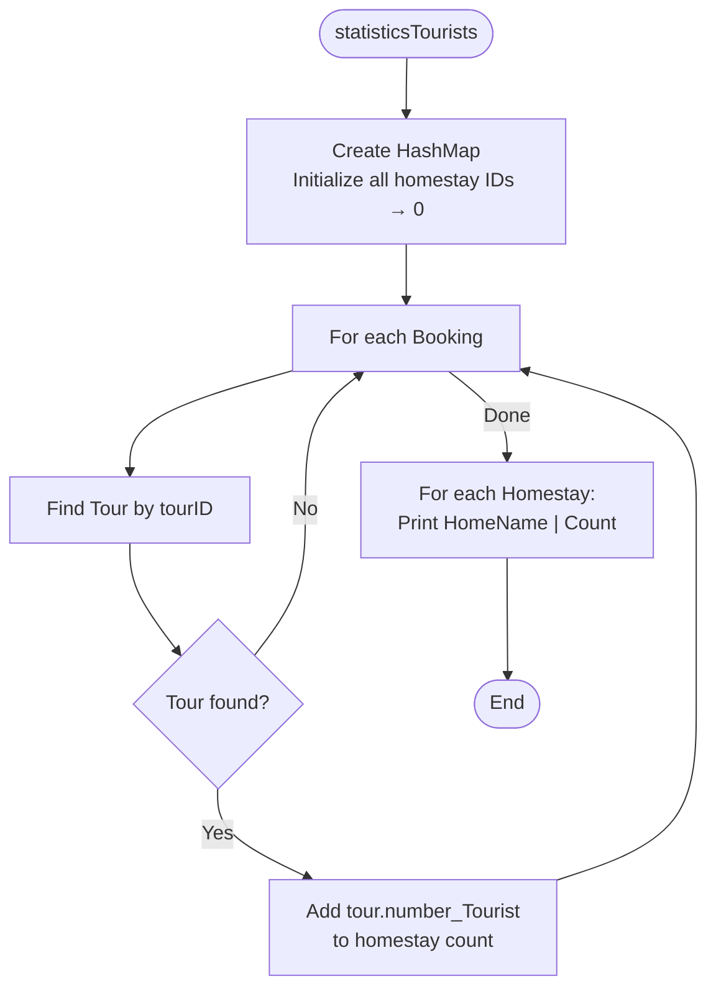

---

### 3.2.10 Function: `fileUtils.readFromFile()` — Generic File Reader

#### Sequence Diagram

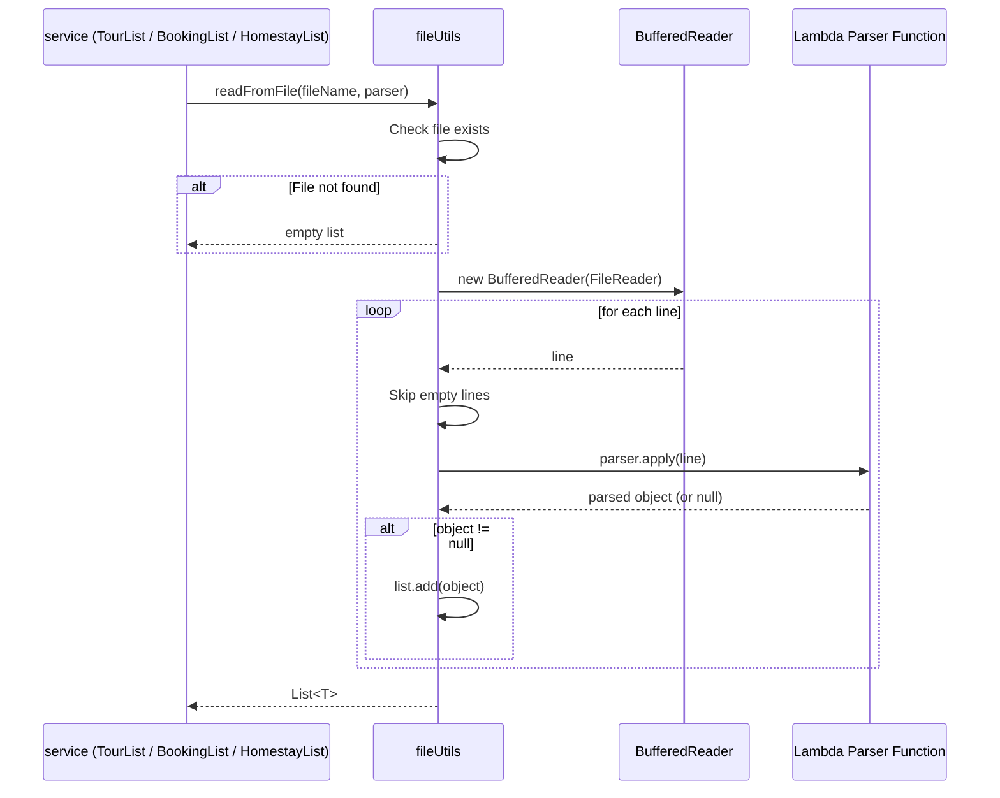

---

<div style="page-break-after: always;"></div>

# 4. Testing & Evaluation

## 4.1 Test Cases for Core Validations

### TC Group 1: Tour ID Validation

| TC#   | Input                          | Expected Result                      | Status |
| ----- | ------------------------------ | ------------------------------------ | ------ |
| TC1.1 | `T00001` (valid, not exists) | Accepted                             | ✅     |
| TC1.2 | `T00001` (valid, exists)     | "Tour ID already exists" → re-input | ✅     |
| TC1.3 | `T001` (too short)           | "Invalid input" → re-input          | ✅     |
| TC1.4 | `t00001` (lowercase)         | "Invalid input" → re-input          | ✅     |
| TC1.5 | `TABCDE` (letters)           | "Invalid input" → re-input          | ✅     |
| TC1.6 |  (empty)                       | "Invalid input" → re-input          | ✅     |

### TC Group 2: Homestay ID Validation

| TC#   | Input                          | Expected Result                  | Status |
| ----- | ------------------------------ | -------------------------------- | ------ |
| TC2.1 | `HS0001` (exists)            | Accepted                         | ✅     |
| TC2.2 | `HS9999` (valid, not exists) | "Homestay not found" → re-input | ✅     |
| TC2.3 | `HS01` (too short)           | "Invalid input" → re-input      | ✅     |
| TC2.4 | `hs0001` (lowercase)         | "Invalid input" → re-input      | ✅     |

### TC Group 3: Booking ID Validation

| TC#   | Input                          | Expected Result                         | Status |
| ----- | ------------------------------ | --------------------------------------- | ------ |
| TC3.1 | `B00001` (valid, not exists) | Accepted                                | ✅     |
| TC3.2 | `B00001` (valid, exists)     | "Booking ID already exists" → re-input | ✅     |
| TC3.3 | `B001` (too short)           | "Invalid input" → re-input             | ✅     |

### TC Group 4: Phone Number Validation

| TC#   | Input                       | Expected Result             | Status |
| ----- | --------------------------- | --------------------------- | ------ |
| TC4.1 | `0869089715` (10 digits)  | Accepted                    | ✅     |
| TC4.2 | `086908971` (9 digits)    | "Invalid input" → re-input | ✅     |
| TC4.3 | `08690897155` (11 digits) | "Invalid input" → re-input | ✅     |
| TC4.4 | `abcdefghij` (letters)    | "Invalid input" → re-input | ✅     |

### TC Group 5: Date Validation

| TC#   | Input                         | Expected Result                   | Status |
| ----- | ----------------------------- | --------------------------------- | ------ |
| TC5.1 | `10/01/2026` (valid)        | Accepted                          | ✅     |
| TC5.2 | `1/1/2026` (wrong format)   | "Invalid date format" → re-input | ✅     |
| TC5.3 | `2026-01-10` (ISO format)   | "Invalid date format" → re-input | ✅     |
| TC5.4 | `31/02/2026` (invalid date) | "Invalid date" → re-input        | ✅     |
| TC5.5 | `abc` (text)                | "Invalid date format" → re-input | ✅     |

### TC Group 6: Date Logic — End Date ≥ Departure Date

| TC#   | Departure      | End            | Expected Result                             | Status |
| ----- | -------------- | -------------- | ------------------------------------------- | ------ |
| TC6.1 | `10/01/2026` | `14/01/2026` | Accepted                                    | ✅     |
| TC6.2 | `10/01/2026` | `10/01/2026` | Accepted (same day)                         | ✅     |
| TC6.3 | `14/01/2026` | `10/01/2026` | "End date must be >= departure" → re-input | ✅     |

### TC Group 7: Tour Date Overlap

| TC#   | Homestay | New Departure  | New End        | Existing Tour        | Expected Result             | Status |
| ----- | -------- | -------------- | -------------- | -------------------- | --------------------------- | ------ |
| TC7.1 | HS0001   | `15/01/2026` | `18/01/2026` | `10/01–14/01`     | Accepted (no overlap)       | ✅     |
| TC7.2 | HS0001   | `12/01/2026` | `16/01/2026` | `10/01–14/01`     | "Date overlaps" → re-input | ✅     |
| TC7.3 | HS0002   | `10/01/2026` | `14/01/2026` | (different homestay) | Accepted (different HS)     | ✅     |

### TC Group 8: Tourist Capacity

| TC#   | Input  | Max Capacity | Expected Result                           | Status |
| ----- | ------ | ------------ | ----------------------------------------- | ------ |
| TC8.1 | `7`  | `15`       | Accepted (7 < 15)                         | ✅     |
| TC8.2 | `15` | `15`       | "Must be < max capacity (15)" → re-input | ✅     |
| TC8.3 | `20` | `15`       | "Must be < max capacity (15)" → re-input | ✅     |

### TC Group 9: Booking Date Before Departure

| TC#   | Booking Date   | Tour Departure | Expected Result                             | Status |
| ----- | -------------- | -------------- | ------------------------------------------- | ------ |
| TC9.1 | `01/01/2026` | `10/01/2026` | Accepted                                    | ✅     |
| TC9.2 | `10/01/2026` | `10/01/2026` | Accepted (same day, not after)              | ✅     |
| TC9.3 | `15/01/2026` | `10/01/2026` | "Must be before tour departure" → re-input | ✅     |

### TC Group 10: Tour Booking Status

| TC#    | Tour Booking Status | Action      | Expected Result                                | Status |
| ------ | ------------------- | ----------- | ---------------------------------------------- | ------ |
| TC10.1 | `false`           | Add Booking | Accepted; tour.booking →`true`              | ✅     |
| TC10.2 | `true`            | Add Booking | "Tour not found or already booked" → re-input | ✅     |

### TC Group 11: Numeric Input Validation

| TC#    | Input                  | Expected Result                             | Status |
| ------ | ---------------------- | ------------------------------------------- | ------ |
| TC11.1 | `400` (positive int) | Accepted                                    | ✅     |
| TC11.2 | `0` (zero)           | "Number must be greater than 0" → re-input | ✅     |
| TC11.3 | `-5` (negative)      | "Number must be greater than 0" → re-input | ✅     |
| TC11.4 | `abc` (text)         | "Invalid number format" → re-input         | ✅     |

### TC Group 12: Search Booking by Name

| TC#    | Search Input | Data                  | Expected Result          | Status |
| ------ | ------------ | --------------------- | ------------------------ | ------ |
| TC12.1 | `Nguyen`   | Name:`Nguyen Van A` | Found (partial match)    | ✅     |
| TC12.2 | `nguyen`   | Name:`Nguyen Van A` | Found (case-insensitive) | ✅     |
| TC12.3 | `XYZ`      | No match              | "No booking found"       | ✅     |

### TC Group 13: Update Fields (Skip with Enter)

| TC#    | Field     | Input               | Expected Result       | Status |
| ------ | --------- | ------------------- | --------------------- | ------ |
| TC13.1 | Tour Name | `New Name`        | Updated to "New Name" | ✅     |
| TC13.2 | Tour Name | *(empty - Enter)* | Keeps original name   | ✅     |
| TC13.3 | Price     | `500.0`           | Updated to 500.0      | ✅     |
| TC13.4 | Price     | *(empty - Enter)* | Keeps original price  | ✅     |

---

<div style="page-break-after: always;"></div>

# 5. Conclusion

## 5.1 Summary

The **Homestay Booking Management Application** successfully implements a complete console-based management system with the following accomplishments:

1. **Layered Architecture:** The application follows a clean MVC-like pattern with separation into models, Services, Controller, view, fileUtils, and utilities packages, promoting maintainability and code reusability.
2. **Complete CRUD Operations:**

   - **Tour Management:** Add new tours with comprehensive validation, update tour details with selective field modification.
   - **Booking Management:** Full lifecycle management including create, update, remove, and search operations.
3. **Robust Input Validation:** A multi-layered validation system using:

   - Regex patterns for ID formats, phone numbers, and dates.
   - Business rule validation (date overlap, capacity limits, booking status).
   - User-friendly error messages with re-input loops.
4. **Data Persistence:** Reliable file-based storage using generic `fileUtils` with lambda-based parsing, ensuring data survives between application sessions.
5. **Reporting & Statistics:** Ability to filter tours by date, calculate total booking amounts with sorting, and aggregate tourist counts per homestay.
6. **Functional Programming:** Effective use of Java's `Function<String, T>` interface and lambda expressions for generic file parsing.

## 5.2 Limitations

| # | Limitation                                               | Impact                                                               |
| - | -------------------------------------------------------- | -------------------------------------------------------------------- |
| 1 | **No GUI** — Console-only interface               | Limited user experience; not suitable for non-technical users        |
| 2 | **Text file storage** — No database               | Not scalable for large datasets; susceptible to file corruption      |
| 3 | **Single-user** — No authentication               | Cannot support multiple operators or role-based access               |
| 4 | **No delete for Tours**                            | Tours can only be added/updated, not removed                         |
| 5 | **Homestay data is read-only**                     | Cannot add/update/delete homestays through the application           |
| 6 | **No undo/rollback**                               | Once data is modified, previous state is lost                        |
| 7 | **removeBooking does not reset Tour booking flag** | After removing a booking, the tour remains marked as booked          |
| 8 | **Duplicate Tour ID in data**                      | `Tours.txt` contains duplicate ID `T00004` for different records |
| 9 | **No data backup mechanism**                       | If file write fails mid-operation, data may be partially lost        |

## 5.3 Future Work

| #  | Enhancement                        | Description                                                                 | Priority |
| -- | ---------------------------------- | --------------------------------------------------------------------------- | -------- |
| 1  | **Graphical User Interface** | Develop a JavaFX or Swing-based GUI for intuitive interaction               | High     |
| 2  | **Database Integration**     | Migrate from text files to MySQL/PostgreSQL for reliability and scalability | High     |
| 3  | **User Authentication**      | Implement login system with admin/operator roles                            | Medium   |
| 4  | **Homestay CRUD**            | Allow full management of homestay records within the application            | Medium   |
| 5  | **Tour Deletion**            | Add ability to delete tours with cascading booking checks                   | Medium   |
| 6  | **Booking-Tour Sync Fix**    | Reset tour `booking` flag when a booking is removed                       | High     |
| 7  | **Data Export**              | Export reports to CSV/Excel/PDF format                                      | Low      |
| 8  | **Search Enhancements**      | Add search by date range, price range, homestay location                    | Medium   |
| 9  | **Logging System**           | Implement audit trail for all operations                                    | Low      |
| 10 | **Unit Testing**             | Add JUnit test suite for automated regression testing                       | Medium   |

---

**— End of Document —**
